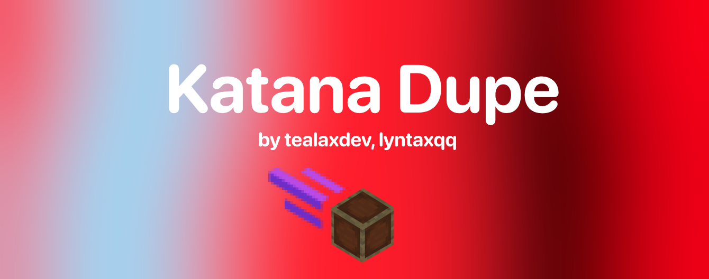

<h1 align="center">
  
</h1>
<p align="center">
  <a href="https://github.com/lyntaxqq/KatanaDupe/LICENSE"></a>
  
  <a href="https://github.com/lyntaxqq/KatanaDupe"></a>
<p align="center">
  <a href="https://github.com/tealaxdev/">🚀 Owner of KatanaDupe</a>
</p>
<p align="center">KatanaDupe is a Meteor Client Add-on for making Item Frame dupes super fast. For anarchy servers.</p>
<p align="center">The project licensed under MIT License. The proejct based on Turkish language but some features may English.</p>

# ℹ️ How to use KatanaDupe?
First of all, download latest JAR from Releases and move it to your mods directory.

After that, you will see Auto Frame Dupe setting on Misc category. Right click to it.

Now maximize EVERYTHING. And change mode from Normal fo Fast. Then, create a 4x4 box. 

Place item frames on the box, everywhere. Make sure no spaces. Now hold a shulker in your hand and activate KatanaDupe.

BOOM! That's it. Now wait as you can wait.

# ⭐ The features of KatanaDupe
- KatanaDupe only supports Item Frame Dupe right now, but new features will be come later. Stay tuned.

# ⚠️ Accountability
```cpp
#include <std_disclaimer.h>

/*
*  No one responsible for these reasons:
*
* I am not responsible for you getting banned on servers, this addon only for
* anarchy servers and if you used it on SMP server or something like that,
* and you get banned, NO ONE IS RESPONSIBLE. YOU are choosing to install this 
* add-on and if you point the finger at me for getting banned on servers, I will laugh at you.
*
*/
```
